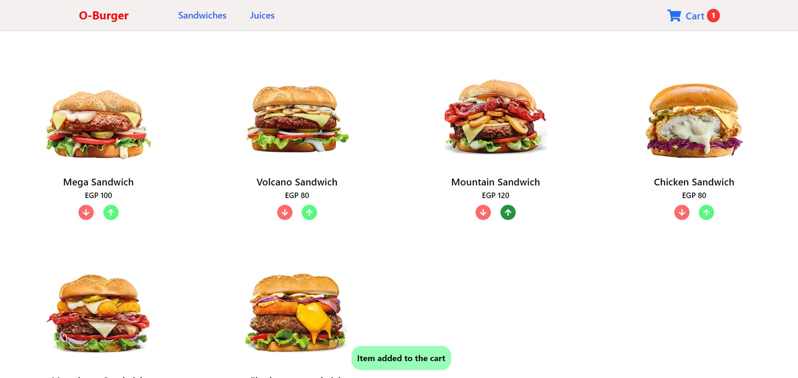

# E-commerce

E-commerce project with React.js and Redux toolkit

## Table of Contents

1- Running the project  
2- Project Interface and Usage  
3- Technologies Used  
4-CopyWrites

### Running the project

First : install the dependencies by command :

```
npm install
```

Second : Run the project :

```
npm start
```

### Project Interface and Usage

Project main page (home page) the user can navigate to two main sections which are sandwiches and juices.
The user can add items to the cart

#### default home page:


#### Updating the cart and pop-up message when adding an item:



#### Cart Page:


#### Cart page in Case it is empty


### Technologies Used

React - Redux Toolkit - CSS - React-router-dom

### Copyrights

&copy; Omar Reda-2023
